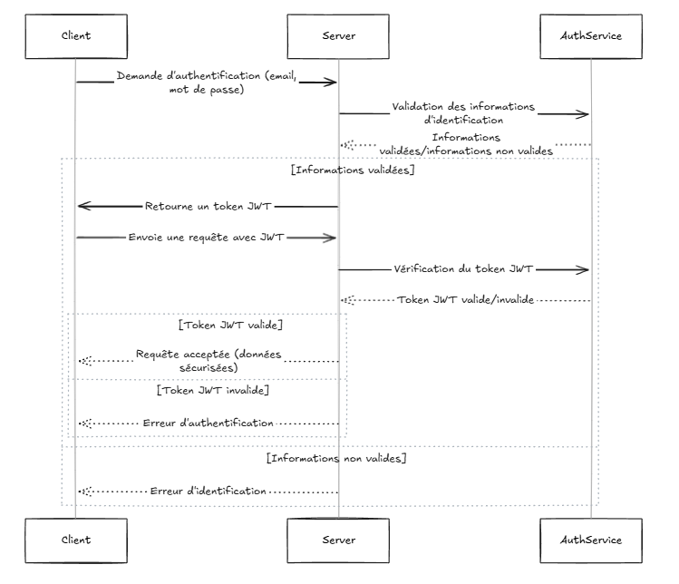

# JSON Web Token (JWT)

## Source :

-   [Curity - JWT Best Practices](https://curity.io/resources/learn/jwt-best-practices/)
-   [JWT.io - Introduction](https://jwt.io/introduction)
-   [PortSwigger - Web Security JWT](https://portswigger.net/web-security/jwt)

## Exercice :

-   JWT - Unsecure File Signature
-   JWT - Jeton révoqué
-   JWT - Secret faible

## Résumé :

### C'est quoi un JWT ?

Un JWT ressemble à une petite carte d'identité numérique : trois bouts de texte
collés par des points (en-tête, données, signature). Le serveur peut vérifier la
signature pour être sûr que le JWT n'a pas été modifiée. Le contenu, lui, reste
lisible par n'importe qui, donc on n'y met pas de donnée risquée.

### Bonnes pratiques essentielles (Curity)

-   Utiliser un algorithme sûr (par ex. RS256) et garder la clé privée hors
    d'atteinte
-   Limiter la durée de vie (exp) : quelques minutes pour un jeton d'accès
-   Ne stocker que ce qui est vraiment utile ; jamais de données sensibles
-   Renouveler les token régulièrement, et prévoir un moyen de révoquer un jeton
    volé

### Erreurs fréquentes et attaques (PortSwigger)

-   Accepter un jeton sans signature ou avec un mauvais algorithme (« none »,
    confusion HS256/RS256)
-   Utiliser des secret trop simples qui se devinent
-   Laisser l'utilisateur modifier des champs comme kid ou jku pour faire
    pointer le serveur vers une clé malveillante
-   Transmettre le jeton sans HTTPS et se le faire intercepter

### Comment se protéger

Toujours vérifier la signature ET l'algorithme, utiliser HTTPS, limiter la durée
et la portée (aud, iss) du jeton, et conserver une « liste noire » (blacklist)
si l'on doit bloquer un jeton avant son expiration.

## Avis :

Le JWT est un aspect important qui permet de certifier l'authenticité d'un
utilisateur si le JWT est bien configuré. Il est important de mettre ce système
en place (ou équivalent) s'il y a un formulaire de connexion.

## Exemple :

### Flux d'authentification avec JWT



### Comment implémenter le middleware :

```csharp
using Microsoft.AspNetCore.Authentication.JwtBearer;

// Configuration du middleware JWT
builder.Services.AddAuthentication(options =>
{
    options.DefaultAuthenticateScheme = JwtBearerDefaults.AuthenticationScheme;
    options.DefaultChallengeScheme = JwtBearerDefaults.AuthenticationScheme;
}).AddJwtBearer(options =>
{
    options.TokenValidationParameters = new TokenValidationParameters
    {
        ValidateIssuer = true,
        ValidateAudience = true,
        ValidateLifetime = true,
        ValidateIssuerSigningKey = true,
        ValidIssuer = builder.Configuration["Jwt:Issuer"],
        ValidAudience = builder.Configuration["Jwt:Audience"],
        IssuerSigningKey = new SymmetricSecurityKey(Encoding.UTF8.GetBytes(builder.Configuration["Jwt:Key"]))
    };
});

// Application du middleware
app.UseAuthentication();
app.UseAuthorization();
```

### Structure d'un token JWT

```json
{
    "Jwt": {
        "Key": "xxxxxxxxxxxx",
        "Issuer": "",
        "Audience": "",
        "ExpireMinutes": 60
    }
}
```
