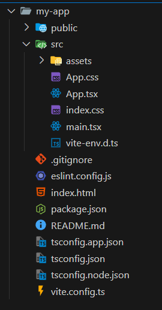
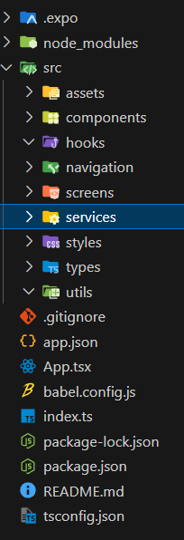

# React with Vite / React avec Vite

## Sources:

-   [Gamma - Become a Frontend Pro with React](https://gamma.app/docs/Devenez-un-pro-du-frontend-avec-React--w5lhk2yp0all3hc?mode=doc)
-   [Medium - Understanding Vite Flow and Structure in a React Project](https://medium.com/@vshall/understanding-vite-flow-and-structure-in-a-react-project-8c8672d62a77)
-   [Medium - How to Structure Folders in Your React Application](https://simeonnortey.medium.com/how-to-structure-folders-in-your-react-application-567ddad3bd7e)
-   [Stack Ademic - Crafting the Perfect React Project: A Comprehensive Guide to Directory Structure](https://blog.stackademic.com/crafting-the-perfect-react-project-a-comprehensive-guide-to-directory-structure-and-essential-9bb0e32ba7aa)
-   [YouTube - React Project Structure](https://www.youtube.com/watch?v=KCrXgy8qtjM)

# EN

## Summary:

### Getting Started Right:

Vite launches the project in seconds, updates the page automatically when code
changes (HMR), and prepares an optimized file for deployment. The index.html
file points directly to main.jsx or main.tsx, making the program entry point
very clear.

### Organizing Files by Feature:

Instead of having a giant "components" folder, create a folder for each feature
(login, cart, etc.). In each folder, put the code, tests, style, and even local
database if needed. Keep only a few "general" folders like components (reusable
everywhere) or assets (images).

### Keeping Code Clean Automatically

Three tools run before each Git submission:

-   Prettier reformats
-   ESLint flags errors
-   Husky verifies everything before validating the commit

We also add "aliases" (@/components/Button) to avoid complicated paths like
../../../components/Button.

### Choosing Small Key Libraries

-   **Zustand**: manages global state with very little code
-   **React Query**: handles API calls and keeps data in cache, which avoids
    rewriting the same requests

Complete with react-router-dom for pages and an interface kit (for example
shadcn/ui or Material UI) if the project grows.

### Working Method

The Gamma slides and the video remind: start simple, write some tests from the
beginning, and note in a small file "why" each architecture decision was made.
This helps newcomers (or yourself in six months) understand the project.

## Advice Received:

-   **Choose Vite + TypeScript from the start**: compilation time divided,
    almost no config
-   **Organize by "features"**: each module is autonomous, making it easier to
    cut or refactor
-   **Set up Prettier/ESLint/Husky** on day one to avoid style divergences
-   **Import aliases**: @/… in Vite + TS to ban ../../../...
-   **Couple Zustand (UI) & React-Query (server-state)**: clearly separate what
    comes from the server from the rest
-   **Document the tree structure** (README or diagram) and test critical
    folders as soon as they appear

## Opinion:

Putting it all together, React is great for a web app. With Vite and TypeScript,
it is quite fast to set up a quick and functional structure. Additionally, by
adding packages like ESLint, it's easy to see errors even before running the
app.

## Example:

### React Vite Project Structure




### Command to Create a Project:

```
npm create vite@latest my-app -- --template react-ts
```

# FR

## Source :

-   [Gamma - Devenez un pro du frontend avec React](https://gamma.app/docs/Devenez-un-pro-du-frontend-avec-React--w5lhk2yp0all3hc?mode=doc)
-   [Medium - Understanding Vite Flow and Structure in a React Project](https://medium.com/@vshall/understanding-vite-flow-and-structure-in-a-react-project-8c8672d62a77)
-   [Medium - How to Structure Folders in Your React Application](https://simeonnortey.medium.com/how-to-structure-folders-in-your-react-application-567ddad3bd7e)
-   [Stack Ademic - Crafting the Perfect React Project: A Comprehensive Guide to Directory Structure](https://blog.stackademic.com/crafting-the-perfect-react-project-a-comprehensive-guide-to-directory-structure-and-essential-9bb0e32ba7aa)
-   [YouTube - Structure de projet React](https://www.youtube.com/watch?v=KCrXgy8qtjM)

## Résumé :

### Comment bien Démarrer :

Vite lance le projet en quelques secondes, met la page à jour toute seule quand
on change le code (HMR) et prépare un fichier final optimisé pour la mise en
ligne. Le fichier index.html pointe directement vers main.jsx ou main.tsx, ce
qui rend l'entrée du programme très claire.

### Ranger les fichiers par fonctionnalité :

Au lieu d'avoir un dossier "components" géant, on crée un dossier par
fonctionnalité (connexion, panier, etc.). Dans chaque dossier on met le code,
les tests, le style et même la petite base de données locale si besoin. On garde
seulement quelques dossiers "généraux" comme components (réutilisables partout)
ou assets (images).

### Garder le code propre automatiquement

Trois outils tournent avant chaque envoi sur Git :

-   Prettier reformate
-   ESLint signale les erreurs
-   Husky vérifie tout ça avant de valider le commit

On ajoute aussi des "alias" (@/components/Button) pour éviter les chemins
compliqués comme ../../../components/Button.

### Choisir des petites bibliothèques clés

-   **Zustand** : gère l'état global avec très peu de code
-   **React Query** : prend en charge les appels API et garde les données en
    cache, ce qui évite de ré-écrire les mêmes requêtes

On complète avec react-router-dom pour les pages et un kit d'interface (par
exemple shadcn/ui ou Material UI) si le projet grossit.

### Méthode de travail

Les slides Gamma et la vidéo rappellent : commencer simple, écrire quelques
tests dès le début et noter dans un petit fichier "pourquoi" chaque décision
d'architecture. Cela aide les nouveaux venus (ou soi-même dans six mois) à
comprendre le projet.

## Conseil reçu :

-   **Choisir Vite + TypeScript dès le départ** : temps de compilation divisé,
    config quasi nulle
-   **Organiser en "features"** : chaque module est autonome, donc plus facile à
    couper ou refactorer
-   **Mettre en place Prettier/ESLint/Husky** le premier jour pour éviter les
    divergences de style
-   **Alias d'import** : @/… dans Vite + TS pour bannir les ../../../...
-   **Coupler Zustand (UI) & React-Query (server-state)** : on sépare clairement
    ce qui vient du serveur du reste
-   **Documenter l'arborescence** (README ou diagramme) et tester les dossiers
    critiques dès qu'ils apparaissent

## Avis :

En regroupant tout ça, React est super pour une app web. Avec Vite et
TypeScript, il est assez rapide de mettre en place une structure rapidement et
fonctionnelle. De plus, en ajoutant des packages comme ESLint, il est facile de
voir les erreurs avant même de lancer l'application.

## Exemple :

### Structure d'un projet React Vite


### Commande pour créer un projet :

```
npm create vite@latest my-app -- --template react-ts
```
